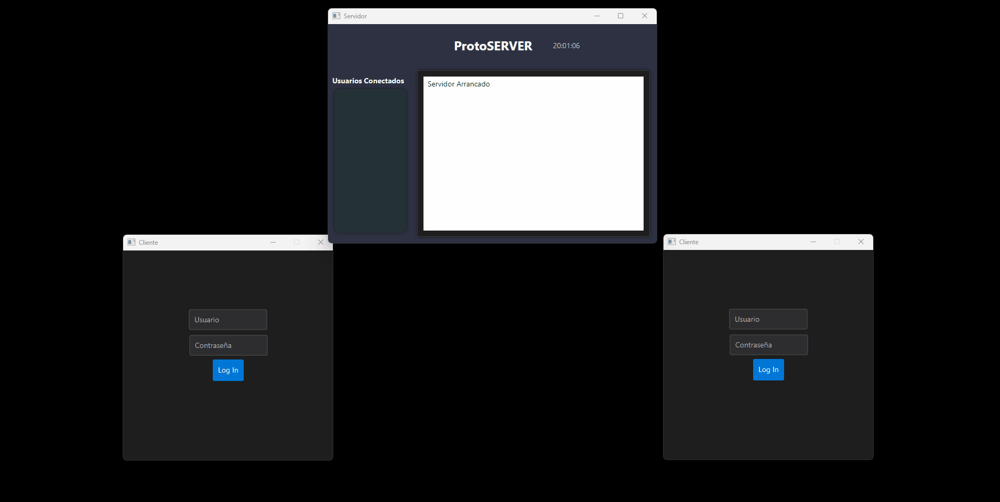
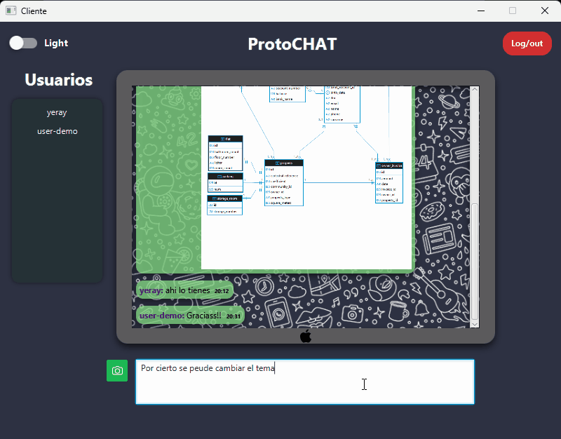
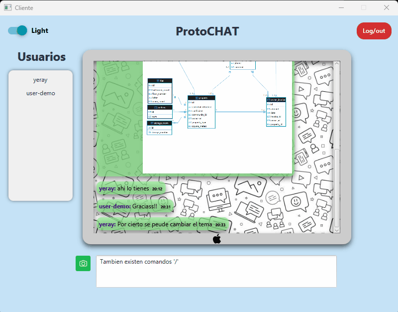
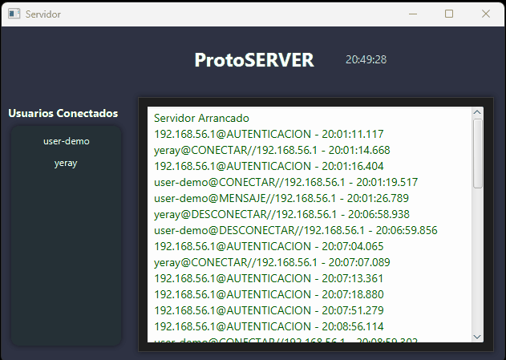

# **Prototipo de Sistema de Chat Cliente-Servidor** 

 [ Español](./README.md) &#124; [ English](./docs/README_EN.md) 


## **Índice**
- [Introducción](#introducción)
- [Objetivo](#objetivo)
- [Recursos utilizados](#recursos-utilizados)
- [Funcionalidades principales](#funcionalidades-principales)
- [Extras y funcionalidades adicionales](#extras-y-funcionalidades-adicionales)
- [Comunicación](#comunicación)
  - [Clase `Paquete` y su Factory](#clase-paquete-y-su-factory)
- [Flujo de comunicación](#flujo-de-comunicación)
- [Demo](#demo)
  - [Autenticación](#autenticación)
  - [Compartir imágenes](#compartir-imagenes)
  - [Tema Oscuro y Claro](#tema-oscuro-y-claro)
  - [Uso de comandos](#uso-de-comandos)
  - [Notificaciones](#notificaciones)
  - [Captura de Logs](#captura-de-logs)
- [Posibles mejoras](#posibles-mejoras)

---
## **Introducción** 

Este proyecto es un sistema de chat con arquitectura cliente-servidor basado en **sockets TCP/IP**. Permite hasta **10 usuarios simultáneos**, todos conectados en una única sala de chat. La interfaz gráfica está desarrollada con **JavaFX**.

Los usuarios pueden interactuar entere sí en tiempo real. El servidor se encarga de distribuir los mensajes y gestionar las conexiones.

## **Objetivo**
Desarrollar una **aplicación de escritorio** que simule un chat, prescindiendo del uso de  **Json** para la comunicación entre los servicios.  
Obligando a serializar objetos y encontrar la alternativa a que distintos nodos (Server y Clientes) puedan entenderse prescindiendo del estandár de comunicación.

## **Recursos utilizados** 

✅ **JavaFX** - Creación de interfaces gráficas   
✅ **Sockets TCP/IP** - Comunicación entre cliente y servidor   
✅ **Maven** - Gestión de dependencias y construcción  
✅ **IntelliJ IDEA** - Entorno de desarrollo   
✅ **CSS** - Cascade Style Sheets   
✅ **Consumo de API** - Integración con https://open-meteo.com/en/docs ☁️   
✅ **PostgreSQL** - Base de datos relacional para almacenamiento persistente de datos  
✅ **Railway** - Plataforma en la nube para desplegar y gestionar PostgreSQL  
✅ **Bcrypt** - Algoritmo de hashing para el almacenamiento seguro de contraseñas   
✅ **Otras funcionalidades** 

<br/>

## **Funcionalidades principales** 

1. **Conexión del cliente** 🔌
   - Acceso mendiante autenticación.
   - Base de datos **PostgreSQL** desplegada en **Railway**.

2. **Mensajes en tiempo real**
   - Todos los mensajes son reenviados a los clientes conectados 
   - Formato: `nickname: mensaje <hora actual>` 

3. **Notificación de nuevos usuarios** 
   - El servidor avisa cuando alguien se une 

4. **Desconexión controlada** 
   - El servidor notifica a los usuarios cuando alguien se desconecta 

6. **Gestión de errores** 
   - Manejo de fallos en la conexión 


<br/>


## **Extras y funcionalidades adicionales** 

🔹 **Comandos especiales** 
   - `/tiempo` - Muestra la temperatura actual usando la API del clima 🌡️
   - `/ping` - Muestra la latencia entre cliente y servidor
   - `/bye` - Logout

🔹 **Envío de archivos** 
   - Permite compartir imágenes en el chat, descargables con doble clic 

🔹 **Links detectados** 
   - Los enlaces enviados en el chat cambian de estilo visualmente para diferenciarlos

🔹 **Temas personalizables** 
   - **Dark mode** (por defecto) 
   - **Light mode** 

<br/>

## **Comunicación** 

Se ha implementado una clase `Paquete` que encapsula los datos enviados entre cliente y servidor. Esto evita inconsistencias en la comunicación y solidifica la estructura del sistema.

### **Clase `Paquete` y su Factory** 

🔹 **Inmutabilidad** - No se pueden modificar tras su creación  
🔹 **Polimorfismo** - Diferentes tipos de paquetes pueden manejarse de forma genérica  
🔹 **Encapsulación de datos** - Cada paquete contiene la IP del emisor y su tipo  
🔹 **Extensibilidad** - Permite agregar nuevos tipos sin modificar el código existente 

Ejemplo de **`PaqueteFactory`**:
```java
public class PaqueteFactory {
    public static Paquete crearPaquete(TipoPaquete tipo, Object... parametros){
        return switch (tipo) {
            case AUTENTICACION -> crearPaqueteAutenticacion(parametros);
            case CONECTAR -> crearPaqueteConectar(parametros);
            case PING -> crearPaquetePING(parametros);
            case DESCONECTAR -> crearPaqueteDesconectar(parametros);
            case NOTIFICACION -> crearPaqueteNotificacion(parametros);
            case MENSAJE -> crearPaqueteMensaje(parametros);
            case ARCHIVO -> crearPaqueteArchivo(parametros);
            case ERROR -> crearPaqueteError(parametros);
            default -> throw new IllegalArgumentException("Tipo de paquete no válido: " + tipo);
        };
    }
}
```

🔹 **JAR Compartido** 
Se ha generado un **JAR** con las clases de `Paquete`, para garantizar que tanto cliente como servidor operen con la misma estructura de datos.

<br/>

## **Flujo de comunicación** 

1. **Autenticación** 
   - Cliente envía un `PaqueteAutenticacion` con sus credenciales
   - Servidor consulta en la base datos las creendenciale s y notifica.

2. **Unión a la sala** 
   - Cliente envía un `PaqueteConectar` con su nickname
   - Servidor lo agrega y notifica a todos

3. **Mensajería en tiempo real** 
   - Los clientes envían mensajes y el servidor los distribuye

4. **Desconexión** 
   - Cliente envía `PaqueteDesconectar`, y el servidor avisa al resto

5. **Cierre del servidor** 
   - Todos los clientes reciben un `PaqueteDesconectar`

<br/>


## **Demo**
### **Autenticación**  
Para acceder al chat es necesario **autenticarse**.  
La base de datos no pertenece al sistema. Se realiza una petición **HTTP** a la plataforma que aloja la **BBDD**.


### **Compartir imagenes**  
Se puede tanto compartir imagenes del sistema en el chat, así como guardarlas.


### **Tema Oscuro y Claro**   
Se puede personalizar el entorno según los temas disponibles.  


###  **Uso de comandos**  
Al introducir **/** se habilita una seleción de comandos como si de un menú  *__IntelliSense__* se tratara.  


###  **Notificaciones**  
Los usuarios son notificados a través de un banner dinámico el acceso o abandono a la sala por parte de otros usuarios.  


###  **Captura de Logs**    
El servidor es reponsable de tramitar todas las acciones que el cliente demanda.    
Guarda todos los registros de las actividades de los usuarios.  


## **Posibles mejoras**
- Implementación de una API REST para mejorar - la gestión de usuarios y mensajes.  
 - Soporte para mensajes privados entre usuarios.  
- Encriptación de mensajes para mayor seguridad.  
 - Integración con WebSockets para optimizar la comunicación.  
 - Migrarlo a Aplicación web o móvil y extender su uso a dispositivos Android/iOS 📱.  
 - Integrar más personalización de entorno.(Fondos, tipos de letras, avatar...).  


