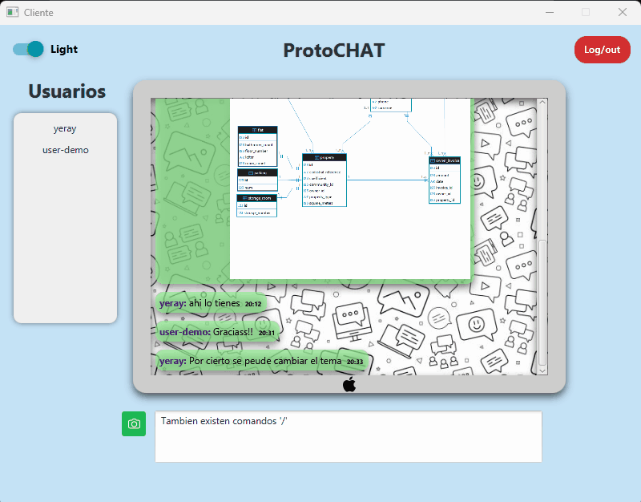
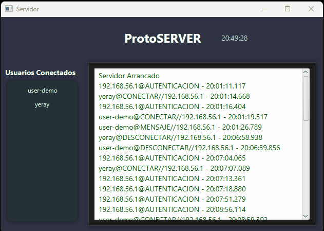

# **Client-Server Prototype Chat**
 [ Español](/README.md) | [ English](./README_EN.md) 

## **Table of Contents**
- [Introduction](#introduction)
- [Objective](#objective)
- [Used Resources](#used-resources)
- [Main Features](#main-features)
- [Extras and Additional Features](#extras-and-additional-features)
- [Communication](#communication)
  - [The `Packet` Class and Its Factory](#the-packet-class-and-its-factory)
- [Communication Flow](#communication-flow)
- [Demo](#demo)
  - [Authentication](#authentication)
  - [Image Sharing](#image-sharing)
  - [Dark and Light Theme](#dark-and-light-theme)
  - [Command Usage](#command-usage)
  - [Notifications](#notifications)
  - [Log Capture](#log-capture)
- [Possible Improvements](#possible-improvements)

---

## **Introduction**

This project is a chat system with a client/server architecture based on **TCP/IP sockets**. It allows up to **10 simultaneous users**, all connected to a single chat room. The graphical interface is developed with **JavaFX**.

Users can interact with each other in real time. The server is responsible for distributing messages and managing connections.

## **Objective**
Develop a **desktop application** that simulates a chat, without using **JSON** for communication between services.  
The system requires object serialization and finding alternatives so different nodes (Server and Clients) can understand each other without relying on communication standards.

## **Used Resources**

✅ **JavaFX** – GUI creation  
✅ **TCP/IP Sockets** – Client/server communication  
✅ **Maven** – Dependency management and build  
✅ **IntelliJ IDEA** – Development environment  
✅ **CSS** – Cascade Style Sheets  
✅ **API Consumption** – Integration with https://open-meteo.com/en/docs ☁️  
✅ **PostgreSQL** – Relational database for persistent storage  
✅ **Railway** – Cloud platform for deploying and managing PostgreSQL  
✅ **Bcrypt** – Hashing algorithm for secure password storage  
✅ **Other functionalities**

<br/>

## **Main Features**

1. **Client Connection** 🔌
   - Access through authentication.
   - **PostgreSQL** database deployed on **Railway**.

2. **Real-time Messaging**
   - All messages are forwarded to connected clients
   - Format: `nickname: message <current time>`

3. **New User Notification**
   - The server notifies when someone joins

4. **Controlled Disconnection**
   - The server notifies users when someone disconnects

5. **Error Handling**
   - Handles connection failures

<br/>

## **Extras and Additional Features**

🔹 **Special Commands**
   - `/weather` – Shows the current temperature using the weather API 🌡️
   - `/ping` – Displays the latency between client and server  
   - `/bye` - Logout


🔹 **File Sending**
   - Allows sharing images in the chat, downloadable by double-clicking

🔹 **Detected Links**
   - Links sent in the chat are visually highlighted

🔹 **Customizable Themes**
   - **Dark mode** (default)
   - **Light mode**

<br/>

## **Communication**

A `Packet` class has been implemented to encapsulate data sent between client and server. This avoids inconsistencies and strengthens the system's structure.

### **The `Packet` Class and Its Factory**

🔹 **Immutability** – Cannot be modified after creation  
🔹 **Polymorphism** – Different packet types can be handled generically  
🔹 **Data Encapsulation** – Each packet contains the sender's IP and its type  
🔹 **Extensibility** – New types can be added without modifying existing code

Example of `PacketFactory`:
```java
public class PacketFactory {
    public static Packet createPacket(PacketType type, Object... parameters){
        return switch (type) {
            case AUTHENTICATION -> createAuthenticationPacket(parameters);
            case CONNECT -> createConnectPacket(parameters);
            case PING -> createPingPacket(parameters);
            case DISCONNECT -> createDisconnectPacket(parameters);
            case NOTIFICATION -> createNotificationPacket(parameters);
            case MESSAGE -> createMessagePacket(parameters);
            case FILE -> createFilePacket(parameters);
            case ERROR -> createErrorPacket(parameters);
            default -> throw new IllegalArgumentException("Invalid packet type: " + type);
        };
    }
}
```
🔹 **Shared JAR**  
A **JAR** file containing the `Packet` classes is provided, ensuring both client and server use the same data structure.

<br/>

## **Communication Flow**

1. **Authentication**
   - Client sends a `AuthenticationPacket` with credentials
   - Server checks the credentials in the database and notifies the result

2. **Joining the Room**
   - Client sends a `ConnectPacket` with their nickname
   - Server adds the user and notifies everyone

3. **Real-time Messaging**
   - Clients send messages and the server distributes them

4. **Disconnection**
   - Client sends a `DisconnectPacket`, and the server notifies the rest

5. **Server Shutdown**
   - All clients receive a `DisconnectPacket`

<br/>

## **Demo**
### **Authentication**
To access the chat, authentication is required.  
The database does not belong to the system. An **HTTP** request is made to the platform hosting the **DB**.  


### **Image Sharing**
You can share images from your system in the chat, as well as save them.  


### **Dark and Light Theme**
You can personalize the environment with available themes.  


### **Command Usage**
When typing **/**, a selection of commands is enabled, similar to an *__IntelliSense__* menu.  


### **Notifications**
Users are notified via a dynamic banner when someone enters or leaves the room.   


### **Log Capture**
The server is responsible for handling all actions requested by the client.   
All user activity logs are saved.  


## **Possible Improvements**
- Implementing a REST API to improve user and message management
- Support for private messages between users
- Encrypting messages for increased security
- Integration with WebSockets to optimize communication
- Migrating to a web or mobile application for use on Android/iOS devices 📱
- More environment customization (backgrounds, fonts, avatars, etc.)

